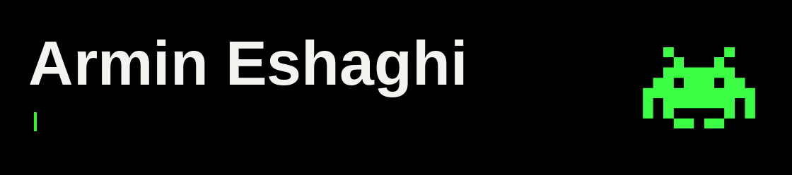
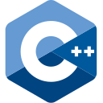
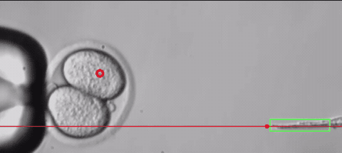

<picture>
  <source media="(prefers-reduced-motion: reduce)" srcset="assets/hello-still.png">
  
</picture>

  
  
  
  
  <a href="https://raw.githubusercontent.com/R-M77/R-M77/main/assets/hello.gif">View header animation ↗</a>

Hi, I'm Armin. My background is in **embedded systems, computer vision, and robotics**, from ASIC validation and hardware/software integration to guiding robots with visual feedback.

I'm building on that experience through **ML systems, inference, compilers, and edge AI**. This profile brings together my research, small tools, and experiments as I work across those areas.

## Tools & technical background

<table>
  <tr>
    <td width="50%" valign="top">
      &nbsp;
      &nbsp;
      <strong>Languages</strong> 
      Python · C · C++ · CUDA
    </td>
    <td width="50%" valign="top">
      &nbsp;
      &nbsp;
       
      <strong>ML &amp; computer vision</strong> 
      PyTorch · TensorFlow / Keras OpenCV · scikit-learn
    </td>
  </tr>
  <tr>
    <td valign="top">
      &nbsp;
      &nbsp;
      <strong>Systems &amp; tooling</strong> 
      Linux · Docker · Git
    </td>
    <td valign="top">
      &nbsp;
      <strong>Hardware &amp; control</strong> 
      Embedded systems · MATLAB · Arduino
    </td>
  </tr>
</table>

## 🔬 Vision-guided microsurgery

During my **M.A.Sc. at the University of Toronto**, I worked on automating single-cell surgery with real-time 3D visual feedback. The footage below is from that research: microscope images are used to track a cell and guide the micromanipulators.

<a href="https://github.com/R-M77/Automated_Microsurgery">
  <picture>
    <source media="(prefers-reduced-motion: reduce)" srcset="assets/microsurgery-still.png">
    
  </picture>
</a>

Actual experiment · Excerpt from Supplementary Video 1 · Computer vision + robot control · <a href="https://raw.githubusercontent.com/R-M77/R-M77/main/assets/microsurgery.gif">Play animated excerpt ↗</a>

I developed image-processing methods to locate features in microscope images and a vision-based controller to guide the tools toward the target. The work brought together **3D image segmentation, motion tracking, and closed-loop control**. The repository contains the supplementary videos and images from these experiments.

**[Watch the experiments →](https://github.com/R-M77/Automated_Microsurgery)** · [Read the paper](https://www.inderscience.com/info/inarticle.php?artid=118413) · [Thesis & publications](https://github.com/R-M77/Resume/blob/main/Publications.md)

## 🛠 Projects & experiments

### [MLIR Cost Model Lab](https://github.com/R-M77/mlir-cost-model-lab)

**Compiler modeling · Python · Regression tests**

I built a small, MLIR-inspired tool for inspecting the costs of tensor graphs. It checks **shapes and value references**, counts scalar work and logical tensor traffic, and calculates **idealized roofline estimates** from supplied compute and bandwidth limits.

The optimization planner tracks which values are still needed and models eligible elementwise fusions. I also added **scalar and tiled/vector matmul representations**, with before-and-after cost reports, plus deterministic regression fixtures and budget gates to catch changes in the estimates.

It's an educational model implemented in Python. It doesn't parse MLIR, generate kernels, or measure hardware performance.

[Explore the lab →](https://github.com/R-M77/mlir-cost-model-lab) · [Examples & model assumptions](https://github.com/R-M77/mlir-cost-model-lab/blob/main/docs/reference.md)

### [Context-aware scheduled jobs](https://github.com/R-M77/openclaw/tree/feat/main-session-agent-turn)

**Scheduler extension · TypeScript · Tests**

I implemented an OpenClaw cron extension for **context-aware scheduled jobs**. The patch lets message-based agentTurn payloads **reuse the main session’s context** through the existing system-event path.

I added CLI and service validation, updated scheduling tests, and tool documentation for the new dispatch path.

[View patch →](https://github.com/R-M77/openclaw/tree/feat/main-session-agent-turn) · [Proposal](https://github.com/openclaw/openclaw/pull/31827)

### [RFID reader integration](https://github.com/R-M77/AMBIENT_video_capture/tree/dev)

**Hardware prototype · C++ · FEIG RFID SDK**

I built a C++ reader-integration prototype that discovers a USB RFID reader, inventories tags, and collects unique identifiers. **Timestamped CSV output** turns reader scans into **structured records for downstream analysis**.

My changes connect the FEIG RFID SDK to the reader experiment and scanner tests.

[Explore the dev branch →](https://github.com/R-M77/AMBIENT_video_capture/tree/dev) · [Reader prototype](https://github.com/R-M77/AMBIENT_video_capture/blob/dev/G_test.cpp)

## What I'm working toward

| Inference & deployment | Compilers & hardware |
| :--- | :--- |
| How precision, latency, and memory use affect model execution and deployment | How models are represented, translated, and run on different hardware targets |
| **Robotics & vision** | **Edge AI** |
| Perception, visual feedback, and control in physical systems | Useful models on smaller devices, with quantization and runtime evaluation |

---

**Find me:** [LinkedIn](https://www.linkedin.com/in/armineshaghi) · [GitHub](https://github.com/R-M77) · [All repositories](https://github.com/R-M77?tab=repositories)
