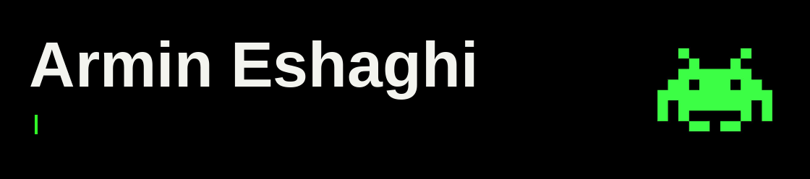

<picture><source media="(prefers-reduced-motion: reduce)" srcset="https://raw.githubusercontent.com/R-M77/R-M77/main/assets/hello-still.png"></picture>

# Embedded vision and ML systems

I build computer vision software for automotive edge processors. I’ve written image-correction libraries in C and tested MobileNet on custom silicon. I’m interested in embedded ML roles where accuracy, latency, and memory use shape what runs on the device.

[Résumé](https://github.com/R-M77/Resume/blob/main/Resume_Armin_Eshaghi.pdf) · [Publications](https://github.com/R-M77/Resume/blob/main/Publications.md) · [LinkedIn](https://www.linkedin.com/in/armineshaghi)

## Vision-guided microsurgery

For my M.A.Sc. at the University of Toronto, I developed methods to locate cell features in 3D and steer a micromanipulator with visual feedback. Each new microscope frame lets the controller check the tool’s position and correct its motion.

<a href="https://github.com/R-M77/Automated_Microsurgery"><picture><source media="(max-width: 550px) and (prefers-reduced-motion: reduce)" srcset="https://raw.githubusercontent.com/R-M77/R-M77/main/assets/figures/control-loop-compact-still.svg"><source media="(prefers-reduced-motion: reduce)" srcset="https://raw.githubusercontent.com/R-M77/R-M77/main/assets/figures/control-loop-still.svg"><source media="(max-width: 550px)" srcset="https://raw.githubusercontent.com/R-M77/R-M77/main/assets/figures/control-loop-compact.svg"></picture></a>

[Watch the 6-second clip](https://github.com/R-M77/R-M77/blob/main/assets/microsurgery.gif) · [Read my first-author paper](https://www.inderscience.com/info/inarticle.php?artid=118413) · [Browse the experiments](https://github.com/R-M77/Automated_Microsurgery)

## Tensor fusion in MLIR Cost Model Lab

I built a Python tool that estimates how much data a tensor program reads and writes. In one example, fusing bias addition with ReLU saves **one 32-byte write and one 32-byte read**. Both plans still require 64 scalar operations.

<a href="https://github.com/R-M77/mlir-cost-model-lab#run-a-reproducible-example"><picture><source media="(max-width: 550px) and (prefers-reduced-motion: reduce)" srcset="https://raw.githubusercontent.com/R-M77/R-M77/main/assets/figures/tensor-fusion-compact-still.svg"><source media="(prefers-reduced-motion: reduce)" srcset="https://raw.githubusercontent.com/R-M77/R-M77/main/assets/figures/tensor-fusion-still.svg"><source media="(max-width: 550px)" srcset="https://raw.githubusercontent.com/R-M77/R-M77/main/assets/figures/tensor-fusion-compact.svg"></picture></a>

[Run the fusion example](https://github.com/R-M77/mlir-cost-model-lab#run-a-reproducible-example) · [Inspect the Python estimator](https://github.com/R-M77/mlir-cost-model-lab/blob/main/src/cost_model/estimator.py)

## JetsonCast for older TVs

My TV had HDMI but no YouTube app, so I turned an 8 GB Jetson Orin Nano into a receiver. VacuumTube handles playback. I built the Linux setup and audio routing, then tested casting from my phone with video and sound over the Jetson’s DisplayPort-to-HDMI connection.

<a href="https://github.com/R-M77/JetsonCast/blob/main/assets/previews/demo-landscape.mp4"><picture><source media="(max-width: 550px) and (prefers-reduced-motion: reduce)" srcset="https://raw.githubusercontent.com/R-M77/R-M77/main/assets/figures/jetsoncast-compact-still.svg"><source media="(prefers-reduced-motion: reduce)" srcset="https://raw.githubusercontent.com/R-M77/R-M77/main/assets/figures/jetsoncast-still.svg"><source media="(max-width: 550px)" srcset="https://raw.githubusercontent.com/R-M77/R-M77/main/assets/figures/jetsoncast-compact.svg"></picture></a>

[Watch the 27-second demo](https://github.com/R-M77/JetsonCast/blob/main/assets/previews/demo-landscape.mp4) · [Set up a receiver](https://github.com/R-M77/JetsonCast#quick-start)

### Other engineering work

- [RFID reader integration in C++](https://github.com/R-M77/AMBIENT_video_capture/blob/dev/G_test.cpp) — USB reader discovery, tag inventory, and timestamped CSV logging.
- [OpenClaw scheduling prototype](https://github.com/R-M77/openclaw/tree/feat/main-session-agent-turn) — a TypeScript change that lets a scheduled job reuse the main session’s conversation context.
